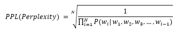
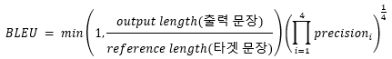

### Perplexity 
- 단어 그 자체로는 당혹감, 고난 등의 뜻을 가지고 있다. <br>
  모델이 문장을 생성할 때 얼마나 확신을 가지고, 혹은 가지기 못하고 해당 문장을 생성했는지를 말한다. <br>
  따라서 높을수록 모델이 확신을 가지고 생성한 값이며, 낮을수록 불확실한 확률값을 기반으로 생성됨을 의미한다. <br>

- 수식 <br>


### BLEU 
- BLEU score 는 크게 두 부분으로 구성된다. <br>
- Brievity Penalty * Precision <br>
    - Brievity Penalty <br>
        = min (1, output length / reference length) <br>
        reference length 에 비해서 생성된 output length 가 더 짧다면, 이것은 더욱 낮은 값을 갖는 penelty 를 가져야 마땅하다.<br>

    - Precision 
        Precision 의 값을 계산할 때는 n-gram (n=1,2,3,4) 의 값이 reference 와 얼마나 일치하는지를 연산한다. 
        ```python
        ret = 1
        for n in [1,2,3,4] : ret *= precision(n)
        ret = sqrt(sqrt(ret))
        ```
- 수식 <br>


- 단점 
    얼마나 reference 단어와의 일치하는지를 파악함, 따라서 단어의 유사성을 판단하지 못함. <br>
    전체적인 문장의 의미가 잘 반영된 지표로 보기는 어려움<br>

### METEOR(Metric for Evaluation of Translation with Explicit ORdering)
- BLEU 의 보완격
    - Precision 뿐만 아니라 recall 값을 연산함 
    - 다른 가중치를 적용한 둘의 조화평균을 활용 (???)
        (어떤 것들 사이의 조화평균을 말하는 건지 불분명하다. 문맥 상으로는 precision 과 recall의 조화평균으로 해석된다.)
    - 오답에 penalty 부과 
    - 여러 단어나 구 등을 정답으로 처리하는 등의 방법 활용 

### SSA(Sensible and Specificity Average)
- 자율발화 모델에 대한 평가 지표 <br>
- 사람이 직접 발화 모델과 대화를 하며 Sensibleness 와 Specificity 를 평가 <br>
- Sensibleness <br>
    모델의 답변이 얼마나 합리적인지를 binary 로 답변 <br>
- Specificity <br>
    모델의 답변이 단답형이 아니고, 구체적인지 여부를 binary 로 답변 <br>
- 0과 1 의 값만을 활용하여 평균낸 값을 취한다.<br>


### Reference 
- https://blog.testworks.co.kr/nlp-generation-evaluation/