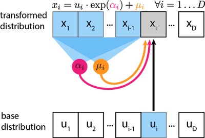
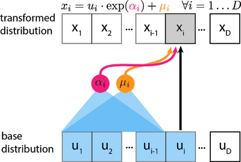

# Probbaility Basic 

## **Elements of probability**
- sample space
- set of outcomes
- probability measures
    - event 가 입력으로 들어왔을 떄 거기에 대응되는 함수
- 몇몇 properites

## **Random Variables**
- Probability Measure for Random Variable
    - CDF
        - culmulative
    - PMF (Mass Function)
        - discrete 한 경우 
    - PDF (Density Function)
        - continuous 한 경우 
        - density function 의 prob 자체는 매우 큰 무한대까지 가질 수 있음. 왜냐면, x의 범위가 어어어어엄청 0에 가깝게 작아지면, 적분하면 1이 되어야 해서.
        - 어떤 RV x 에서 어떤 RV y 에 대한 분포를 transformation 해서 구한다고 생각해보자. 
            y = f(x) 일 때,  P_y(y) = P_x(x)*|gradient| 로 구해짐.  
            일반적으로 vector의 경우도 그러함. 여기서 f를 NN 으로 쓰게 되면, invertible 하지 않기 때문에 y의 likelihood 를 구할 수가 없음. 
        - Normalizing Flow
            
            Normalizing Flwo는 invertible transformation 을 통해 점점 좀 더 복잡한 distritbuiton 을 invertible한 연산을 통해 만들어 나간다. 이를 통해 최종 target variable의 probability distribution을 invertible transformation을 통해 추적할 수 있다. 
        - Masked Autoregressive Flow
              
            각 step을 거치며 지나는 분포를 NN의 invertible 함에서 얻는 것이 아니라, NN의 autoregressive 함을 통해 각 step의 평균과 분산을 얻는다. base distribution을 정보와 이전 스텝의 평균, 분산 정보를 활용하여 해당 step i의 x_i 값을 구한다.
        
        - Inverse Augoregressive Flow
              
            위의 MAF 는 sampling 과정의 속도가 heavy해서, 평균과 분산을 얻는 것을 base distribution 에서 뽑아보자는 제안
- Expectation & Variance
    - Expectation 은,, E[X] = sum(p_x*x) 임
    - Distrete Distribution
        - Bernoulli (Binary Distribution)
            - p(x) = p^x*(1-p)^(1-x)
        - Binomial
            - binary distribution 이 N번 수행되는 것
        - Negative Binomial
            - n 번의 failure 가 observable 할 때까지 몇 개의 1이 등장하는지 
            무한해질 수 있음
        - Poisson
            - event 의 발생 횟수가 궁금할 때
    - Continuous Distribution
        - Normal (CLT, useful in many domains) / Uniforam / Exponential
    - **어떤 distribution이 있는지 아는 것보다, 내가 사용하고자 하는 random variable 이 어떤 distribution에 mapping 되는지 인지하는 것이 더 중요함!**
    - Variance
        - 평균으로부터 퍼져있는 정도 
        - multiple variable 가 될 경우
            - joint distribution으로 표현할 수 있음 
            - joint distribution 의 상대적으로 대조되는 개념은 marginal distribution! 
                - marginal은 여러 다 변수 중 1,2개의 변수만을 고려하는 경우, 즉 그 1,2개의 변수만을 marginalized 시키는 경우이다.
        - Indepence
            - cdf, pdf, pmf 등에서 joint distribution이 각 random variable의 distribution으로 factorization 이 되면 독립이라고 말할 수 있음
    - Convariance
        - 두개 이상의 변수 사이의 퍼짐 정도. (variation의 extension)
        - 만약 두 변수가 independent 하다면, uncorrelated 하다고 말할 수 있음 
        (역은 성립 못함)
    - Correlation
        - Normalized version of covarriance 이다
        - corr[X,Y] = Cov[X,Y] / sqrt(Var(X), Var(Y)) (-1과 1 사이의 값)
    - Covariance Matrix
        - multiple variables 일 경우, Covariance 값을 각 변수 사이에 따라 matrix로 표현 가능
    - Multivariate Normal Distribution
        - Normal Distribution을 1변수에서 다변수로 자연스럽게 확장할 수 있음
            scalar → vector 
        - 매우 유용함
            - MLE(Maximum Likelihood Estimation) interpolation for least square
            - Gaussian Mixtutre Model
                - 여러가지의 Gaussian Dist component 들을 합성하는 방법론
            - Even in Bayesian DL (Gaussian Prior)
                - prior distribution을 가정하는 경우에도 많이 쓰임 
        - **기억하기 !**
            - joint distribution 이 normal 이면 marginal distribution도 normal 이다!
            - joint distribution 이 normal 이면 conditional distribution 도 normal이다!
                - 다소 복잡한(?) 값을 과정과 값을 가지지만, Schur complement 에 의해 Precision Matrix (Covariance의 Inverse Matrix) 의 값을 활용하여 계산하면, normal distribution 이 됨을 보일 수 있음
                
## **2 RULES ! (Important)**
- conditinal probabiltiy
    - 일반적으로 딥러닝은, 기존의 데이터 X 가 주어질 때 , 새로운 보지 않은 데이터 X’ 가 나올 확률을 구하는 문제이다. 따라서 조건부 확률적인 부분이 중요하다.
    $$
    P_{Y|X}(y|x) = \frac{P_{X,Y}(x,y)}{P_X(x)}
    $$
    - 즉, conditional probability 는 “x가 이미 발생한 이후, joint distritbution 이 발생한 경우” 로 볼 수 있음

- **sum rule**
    - P(x) = sum(P(x,y)) (y에대해 summation 할 때)
        - joint prob p(x,y) 를 y 또는 x 하나의 변수에 대해서 summation하면 marginal distribution을 얻을 수 있음.
    - continuous 한 경우는 integral 을 써서 보이면 됨.

- **product rule**
    - joint distribution = conditional distribution * marginal distribution 이 됨. 
    - P(X,Y) = P(Y|X) * P(X) = P(X|Y) * P(Y) 
    - ex 
        - marginal prob P(Y)   
        = summation of {joint distribution}  
        = P(Y_o|X_red) + P(Y_o|X_blue)  
            (각 joint distribution = product rule 로 값을 표현할 수 있음) 
            so,  
            = product rule_1 + product_rule_2  
            (이 값들은 구할 수 있는 경우 有) 

## Self 문답 
1. implicit 의 의미는?  
    내가 이해한 바로는, y의 pdf는 얻을 수가 없다는 말이다. 왜냐하면, y로 가는 함수 f 자체가 direct 하게 distribution을 approximation 하려 하는 것인데, 이 f가 invertible 하지 않기 때문이다.  

2. 그래서 invertible한 tranformation 을 가지는 연구 흐름이 normalizing flow이다.  
    affine transfomration, leakly ReLu 등 invertible 한 변환들을 활용하여, gradient 를 trackable하게 구하고, 기존 x 에서, y로 변환되는 부분들을 얻고자 하는 것이다.  

3. likelihood (가능도 즉, 어떤 결과 x가 관찰되었을 때, 그 결과가 나올 확률 분포 distribution이 얼마인지 예측하는 값)  
    참고 링크 : https://jjangjjong.tistory.com/41  

## Reference 
- https://blog.evjang.com/2018/01/nf2.html
- https://lilianweng.github.io/posts/2018-10-13-flow-models/
- https://jjangjjong.tistory.com/41